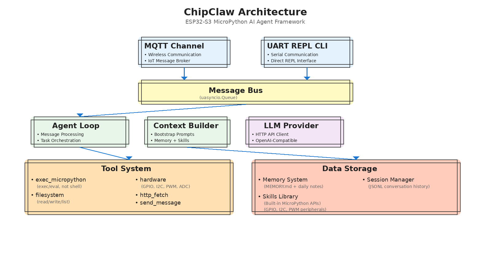

# ChipClaw Architecture Design Document

## 1. Project Overview

**ChipClaw** is a lightweight AI agent framework running on ESP32-S3 microcontrollers that brings the core architecture of [HKUDS/nanobot](https://github.com/HKUDS/nanobot) to embedded systems. It enables autonomous hardware control, self-programming capabilities, and multi-channel communication through MQTT and UART interfaces.

### Target Hardware
- **Platform**: ESP32-S3
- **Flash Memory**: 16MB
- **PSRAM**: 8MB
- **Runtime**: MicroPython (v1.20+)

### Relationship to Nanobot
ChipClaw is a **port** of nanobot's core architecture, adapted for MicroPython and embedded constraints:
- Preserves the agent loop, tool system, memory, and skills architecture
- Replaces Python standard library with MicroPython equivalents
- Optimizes for limited RAM (8MB PSRAM vs. GB desktop RAM)
- Adds ESP32-specific capabilities (GPIO, I2C, PWM, ADC)
- Removes desktop-specific features (terminal UI, subprocess execution)

### Key Features
- **Multi-channel I/O**: MQTT (wireless) and UART REPL CLI (serial) communication
- **LLM Integration**: OpenAI-compatible API calls via HTTPS
- **Tool System**: Filesystem, hardware control, HTTP fetch, self-programming via `exec()`/`eval()`
- **Memory System**: Long-term memory (MEMORY.md) and daily notes
- **Skills Framework**: Markdown-based skill documents with built-in MicroPython peripheral APIs
- **Session Management**: JSONL-based conversation history
- **Self-Programming**: Execute MicroPython code via `exec()` (not shell commands)

### Architecture Diagram

<p align="center">
  
</p>

**Key Architecture Highlights**:

1. **Channel Layer**: MQTT and UART REPL CLI channels (replacing terminal/Telegram from nanobot)
2. **Message Bus**: `uasyncio.Queue`-based asynchronous event routing
3. **Agent Core**: Agent Loop, Context Builder, and LLM Provider working together
4. **Tool System**: 
   - `exec_micropython`: MicroPython code execution via `exec()`/`eval()` (not shell commands)
   - `hardware`: Direct GPIO, I2C, PWM, ADC peripheral access
   - `filesystem`: File operations
   - `http_fetch`: HTTP requests
   - `send_message`: Channel communication
5. **Data Storage**: 
   - Memory system for long-term knowledge
   - Skills library with built-in MicroPython peripheral API documentation
   - Session manager for conversation history

---

## 2. Directory Structure

ChipClaw's filesystem layout mirrors nanobot's workspace structure while adapting to Flash storage constraints:

```
/ (ESP32-S3 Flash Root)
├── boot.py                          # WiFi + NTP initialization
├── main.py                          # Entry point → uasyncio event loop
├── config.json                      # Device configuration (JSON)
│
├── docs/
│   └── DESIGN.md                    # This document
│
├── chipclaw/                        # Main package (replaces 'nanobot' package)
│   ├── __init__.py
│   ├── config.py                    # JSON config loader (replaces Pydantic)
│   ├── utils.py                     # Utility functions (time, paths, gc)
│   │
│   ├── bus/                         # Message bus (replaces nanobot.bus)
│   │   ├── __init__.py
│   │   ├── events.py                # InboundMessage / OutboundMessage
│   │   └── queue.py                 # MessageBus (uasyncio.Queue)
│   │
│   ├── providers/                   # LLM providers (replaces nanobot.providers)
│   │   ├── __init__.py
│   │   ├── base.py                  # LLMProvider / LLMResponse / ToolCallRequest
│   │   └── http_provider.py        # urequests-based OpenAI API caller
│   │
│   ├── agent/                       # Agent core (replaces nanobot.agent)
│   │   ├── __init__.py
│   │   ├── loop.py                  # Agent main loop
│   │   ├── context.py               # System prompt builder
│   │   ├── memory.py                # Memory system (MEMORY.md + daily)
│   │   ├── skills.py                # Skills loader (frontmatter parsing)
│   │   │
│   │   └── tools/                   # Tools (replaces nanobot.tools)
│   │       ├── __init__.py
│   │       ├── base.py              # Tool abstract base
│   │       ├── registry.py          # ToolRegistry
│   │       ├── filesystem.py        # read_file, write_file, list_dir
│   │       ├── message.py           # Send message to channel
│   │       ├── hardware.py          # GPIO, I2C, PWM, ADC
│   │       ├── exec_mpy.py          # exec() MicroPython code
│   │       └── http_fetch.py        # HTTP GET tool
│   │
│   ├── channels/                    # Communication channels (replaces nanobot.channels)
│   │   ├── __init__.py
│   │   ├── base.py                  # BaseChannel abstract
│   │   ├── mqtt.py                  # MQTT channel (umqtt.robust)
│   │   └── uart.py                  # UART channel (machine.UART)
│   │
│   └── session/                     # Session management (replaces nanobot.session)
│       ├── __init__.py
│       └── manager.py               # SessionManager + Session (JSONL)
│
├── workspace/                       # User workspace (mirrors ~/.nanobot/workspace/)
│   ├── AGENTS.md                    # Bootstrap: agent behavior instructions
│   ├── IDENTITY.md                  # Bootstrap: agent identity
│   ├── memory/                      # Memory storage (mirrors ~/.nanobot/workspace/memory/)
│   │   ├── MEMORY.md                # Long-term memory (created at runtime)
│   │   └── YYYY-MM-DD.md            # Daily notes (created at runtime)
│   └── skills/                      # User skills (mirrors ~/.nanobot/workspace/skills/)
│       └── hardware/                # Built-in hardware skill
│           └── SKILL.md             # Hardware capabilities documentation
│
├── data/                            # Runtime data (mirrors ~/.nanobot/)
│   └── sessions/                    # Session files (mirrors ~/.nanobot/sessions/)
│       └── {session_key}.jsonl      # JSONL conversation history
│
└── README.md                        # Project README
```

### Key Differences from Nanobot
| Aspect | Nanobot | ChipClaw |
|--------|---------|----------|
| Config location | `~/.nanobot/config.toml` | `/config.json` (Flash root) |
| Workspace | `~/.nanobot/workspace/` | `/workspace/` |
| Sessions | `~/.nanobot/sessions/` | `/data/sessions/` |
| Config format | TOML (Pydantic) | JSON (plain dict) |
| Paths | `pathlib.Path` | String paths + `os` module |

---

## 3. Module Mapping Table

| Nanobot Module | ChipClaw Module | Preservation | Key Differences |
|----------------|-----------------|--------------|-----------------|
| `nanobot.config` | `chipclaw.config` | **High** | JSON instead of TOML; plain dict instead of Pydantic |
| `nanobot.bus.events` | `chipclaw.bus.events` | **High** | Plain classes (no `@dataclass`) |
| `nanobot.bus.queue` | `chipclaw.bus.queue` | **High** | `uasyncio.Queue` instead of `asyncio.Queue` |
| `nanobot.providers.base` | `chipclaw.providers.base` | **High** | Simplified abstractions (no ABC) |
| `nanobot.providers.openai` | `chipclaw.providers.http_provider` | **Medium** | `urequests` instead of `httpx`; no streaming |
| `nanobot.agent.loop` | `chipclaw.agent.loop` | **High** | Same flow; added `gc.collect()` |
| `nanobot.agent.context` | `chipclaw.agent.context` | **High** | Removed `pathlib`; added ESP32 runtime info |
| `nanobot.agent.memory` | `chipclaw.agent.memory` | **High** | String paths; 3-day window (vs. 7-day) |
| `nanobot.agent.skills` | `chipclaw.agent.skills` | **High** | Simplified frontmatter parsing |
| `nanobot.tools.*` | `chipclaw.agent.tools.*` | **Medium** | Removed shell/subprocess tools; added hardware tools |
| `nanobot.channels.terminal` | *(removed)* | **N/A** | Terminal UI not feasible on ESP32 |
| `nanobot.channels.telegram` | *(removed)* | **N/A** | Telegram requires polling/webhooks |
| *(none)* | `chipclaw.channels.mqtt` | **New** | MQTT support for IoT |
| *(none)* | `chipclaw.channels.uart` | **New** | Serial communication |
| `nanobot.session.manager` | `chipclaw.session.manager` | **High** | JSONL format preserved |
| `nanobot.utils` | `chipclaw.utils` | **Medium** | Removed pathlib; added ESP32 helpers |

---

## 4. Module-by-Module Design

### 4.1 Bus System (`chipclaw/bus/`)

#### `events.py` — Message Events
**Purpose**: Define inbound/outbound message structures.

**Classes**:
```python
class InboundMessage:
    """Message from external channel → agent"""
    def __init__(self, channel, sender_id, chat_id, content, media=None, metadata=None):
        self.channel = channel      # "mqtt" | "uart"
        self.sender_id = sender_id  # User/device identifier
        self.chat_id = chat_id      # Conversation identifier
        self.content = content      # Message text
        self.media = media          # Optional media data
        self.metadata = metadata    # Optional metadata dict
    
    @property
    def session_key(self):
        """Returns 'channel:chat_id' for session lookup"""
        return f"{self.channel}:{self.chat_id}"

class OutboundMessage:
    """Message from agent → external channel"""
    def __init__(self, channel, chat_id, content, reply_to=None, media=None, metadata=None):
        self.channel = channel
        self.chat_id = chat_id
        self.content = content
        self.reply_to = reply_to    # Optional InboundMessage reference
        self.media = media
        self.metadata = metadata
```

**Key Design Notes**:
- Plain classes (no `@dataclass` — MicroPython lacks it)
- `session_key` property enables multi-channel session management
- `metadata` dict supports extensibility (e.g., MQTT QoS, UART flow control)

#### `queue.py` — MessageBus
**Purpose**: Central message routing with asyncio queues.

**Class**:
```python
class MessageBus:
    def __init__(self):
        self.inbound = uasyncio.Queue()   # InboundMessage queue
        self.outbound = uasyncio.Queue()  # OutboundMessage queue
        self.subscribers = {}             # {channel: callback}
        self._running = False
    
    async def publish_inbound(self, msg):
        """Channel → Bus"""
        await self.inbound.put(msg)
    
    async def consume_inbound(self):
        """Bus → Agent (blocking)"""
        return await self.inbound.get()
    
    async def publish_outbound(self, msg):
        """Agent → Bus"""
        await self.outbound.put(msg)
    
    def subscribe_outbound(self, channel, callback):
        """Register channel callback for outbound dispatch"""
        self.subscribers[channel] = callback
    
    async def dispatch_outbound(self):
        """Bus → Channels (background loop)"""
        while self._running:
            msg = await self.outbound.get()
            callback = self.subscribers.get(msg.channel)
            if callback:
                await callback(msg)
    
    def stop(self):
        self._running = False
```

**Key Design Notes**:
- `uasyncio.Queue` for async message passing
- Subscriber pattern for outbound routing
- Background `dispatch_outbound()` loop runs concurrently with agent loop

---

### 4.2 LLM Providers (`chipclaw/providers/`)

#### `base.py` — Abstractions
**Purpose**: Define LLM request/response structures.

**Classes**:
```python
class ToolCallRequest:
    def __init__(self, id, name, arguments):
        self.id = id                # Unique call ID (from LLM)
        self.name = name            # Tool name
        self.arguments = arguments  # Dict of parameters

class LLMResponse:
    def __init__(self, content, tool_calls, finish_reason, usage):
        self.content = content            # Response text (or None)
        self.tool_calls = tool_calls      # List of ToolCallRequest (or None)
        self.finish_reason = finish_reason # "stop" | "tool_calls" | "length"
        self.usage = usage                # Token usage dict
    
    @property
    def has_tool_calls(self):
        return self.tool_calls is not None and len(self.tool_calls) > 0
```

#### `http_provider.py` — HTTP Provider
**Purpose**: Call OpenAI-compatible APIs via `urequests`.

**Key Methods**:
```python
class HTTPProvider:
    def __init__(self, api_key, api_base):
        self.api_key = api_key
        self.api_base = api_base
    
    async def chat(self, messages, tools=None, model="gpt-4", max_tokens=4096, temperature=0.7):
        """
        POST {api_base}/chat/completions
        Returns: LLMResponse
        """
        # 1. Build request body (OpenAI format)
        # 2. urequests.post() with Bearer auth
        # 3. Parse JSON response
        # 4. Extract content/tool_calls
        # 5. gc.collect() before/after
```

**Key Design Notes**:
- Uses `urequests` (MicroPython) with fallback to `requests` (CPython testing)
- No streaming support (memory constraints)
- Truncates large responses if needed
- `gc.collect()` before/after HTTP calls to free memory

---

### 4.3 Agent Core (`chipclaw/agent/`)

#### `memory.py` — Memory System
**Purpose**: Manage long-term and daily memories.

**Layout** (mirrors nanobot):
```
workspace/memory/
├── MEMORY.md          # Long-term knowledge base
└── 2026-02-11.md      # Daily notes (auto-created)
```

**Class**:
```python
class MemoryStore:
    def __init__(self, workspace):
        self.workspace = workspace
        self.memory_dir = workspace + "/memory"
    
    def read_long_term(self):
        """Read MEMORY.md"""
    
    def write_long_term(self, content):
        """Write MEMORY.md"""
    
    def read_today(self):
        """Read today's YYYY-MM-DD.md"""
    
    def append_today(self, content):
        """Append to today's note"""
    
    def get_recent_memories(self, days=3):
        """Get last N days of daily notes (reduced from 7 for ESP32)"""
    
    def get_memory_context(self):
        """Format memory for system prompt"""
```

**Key Design Notes**:
- String paths (no `pathlib`)
- `time.localtime()` for date (no `datetime` module)
- 3-day memory window (vs. 7 in nanobot) to save RAM

#### `skills.py` — Skills Loader
**Purpose**: Load and manage skill documents.

**Skill Structure**:
```markdown
---
name: hardware_control
description: Control GPIO pins and sensors
load: always
---

# Hardware Control Skill

## GPIO
- Set pin 2 to HIGH: `{"name": "gpio", "params": {"pin": 2, "mode": "write", "value": 1}}`
```

**Class**:
```python
class SkillsManager:
    def __init__(self, workspace):
        self.workspace = workspace
        self.user_skills_dir = workspace + "/skills"
        self.builtin_skills_dir = "/chipclaw/skills"  # (if added)
    
    def list_skills(self):
        """Scan all skills (user + builtin)"""
    
    def load_skill(self, name):
        """Load skill markdown + frontmatter"""
    
    def get_always_skills(self):
        """Get skills with 'load: always'"""
    
    def build_skills_summary(self):
        """Generate available skills list for context"""
```

**Key Design Notes**:
- Simple frontmatter parser (no YAML library — parse `---` blocks manually)
- Skills stored in `workspace/skills/{name}/SKILL.md`
- Supports `load: always` for auto-loading

#### `context.py` — Context Builder
**Purpose**: Assemble system prompt from bootstrap + memory + skills.

**Bootstrap Files** (in workspace):
- `AGENTS.md` — Agent behavior instructions
- `IDENTITY.md` — Agent identity/personality
- `SOUL.md` (optional) — Extended identity
- `USER.md` (optional) — User profile
- `TOOLS.md` (optional) — Tool usage guidelines

**Key Methods**:
```python
class ContextBuilder:
    def __init__(self, workspace, memory, skills):
        self.workspace = workspace
        self.memory = memory
        self.skills = skills
    
    def build_system_prompt(self, channel, chat_id):
        """
        Assemble system prompt:
        1. Identity (ESP32-S3 runtime info)
        2. Bootstrap files (AGENTS.md, etc.)
        3. Memory context
        4. Active skills
        5. Skills summary
        """
    
    def build_messages(self, history, current_message, channel, chat_id):
        """
        Build messages list for LLM:
        [
            {"role": "system", "content": system_prompt},
            {"role": "user", "content": history[0]},
            {"role": "assistant", "content": history[1]},
            ...
            {"role": "user", "content": current_message}
        ]
        """
    
    def add_assistant_message(self, content):
        """Helper: add assistant message"""
    
    def add_tool_result(self, tool_call_id, result):
        """Helper: add tool result message"""
```

**Key Design Notes**:
- Includes ESP32-S3 runtime info (free RAM, Flash usage)
- Uses `os.statvfs()` for filesystem stats
- Uses `gc.mem_free()` for RAM stats

#### `loop.py` — Agent Loop
**Purpose**: Main agent processing loop.

**Flow** (same as nanobot):
```
1. Consume message from bus
2. Load/create session
3. Build context (system prompt + history + current message)
4. LLM.chat() → response
5. If tool_calls:
   a. Execute tools
   b. Add tool results to context
   c. LLM.chat() again (loop up to max_iterations)
6. Send response via bus
7. Save session
8. gc.collect()
```

**Class**:
```python
class AgentLoop:
    def __init__(self, bus, provider, sessions, context, tools, config):
        self.bus = bus
        self.provider = provider
        self.sessions = sessions
        self.context = context
        self.tools = tools
        self.config = config
    
    async def run(self):
        """Main loop: process inbound messages"""
        while True:
            msg = await self.bus.consume_inbound()
            await self._handle_message(msg)
    
    async def _handle_message(self, msg):
        """Process one message → response"""
        # 1. Get session
        # 2. Build messages
        # 3. LLM call
        # 4. Tool execution loop
        # 5. Send response
        # 6. Save session
```

**Key Design Notes**:
- `gc.collect()` between iterations
- Limits tool iterations (default 15)
- Saves session after each response

---

### 4.4 Tools System (`chipclaw/agent/tools/`)

#### `base.py` — Tool Base
**Purpose**: Abstract base for all tools.

**Class**:
```python
class Tool:
    """Base class for tools (no ABC — MicroPython compatibility)"""
    name = None
    description = None
    parameters = {}  # JSON Schema dict
    
    def execute(self, **params):
        """Override in subclass"""
        raise NotImplementedError
    
    def to_schema(self):
        """Return OpenAI function schema"""
        return {
            "type": "function",
            "function": {
                "name": self.name,
                "description": self.description,
                "parameters": self.parameters
            }
        }
```

#### `registry.py` — Tool Registry
**Purpose**: Manage tool registration and execution.

**Class**:
```python
class ToolRegistry:
    def __init__(self):
        self.tools = {}  # {name: Tool instance}
    
    def register(self, tool):
        """Register a tool instance"""
        self.tools[tool.name] = tool
    
    def get(self, name):
        """Get tool by name"""
        return self.tools.get(name)
    
    def get_definitions(self):
        """Return list of tool schemas for LLM"""
        return [tool.to_schema() for tool in self.tools.values()]
    
    def execute(self, name, params):
        """Execute tool by name with params"""
        tool = self.get(name)
        if not tool:
            return f"Error: Tool '{name}' not found"
        try:
            return tool.execute(**params)
        except Exception as e:
            return f"Error: {e}"
```

#### `filesystem.py` — File Operations
**Tools**:
1. **ReadFileTool** — Read file contents
   - Params: `path` (string)
   - Returns: file content (truncated to 10KB if needed)
   - Respects `allowed_dir` (default: `/workspace/`)

2. **WriteFileTool** — Write file contents
   - Params: `path` (string), `content` (string)
   - Auto-creates parent directories
   - Respects `allowed_dir`

3. **ListDirTool** — List directory contents
   - Params: `path` (string, default: `"."`)
   - Returns: list of `{name, type, size}` dicts

**Key Design Notes**:
- Security: Restricts file access to `/workspace/` by default (configurable)
- Uses `os` module (no `pathlib`)

#### `hardware.py` — Hardware Control
**Tools**:
1. **GPIOTool** — GPIO operations
   - Modes: `read`, `write`, `pwm`, `adc`
   - Params: `pin`, `mode`, `value` (optional), `freq` (optional for PWM)
   - Uses `machine.Pin`, `machine.PWM`, `machine.ADC`

2. **I2CScanTool** — Scan I2C bus
   - Params: `scl` (int), `sda` (int)
   - Returns: list of detected I2C addresses
   - Uses `machine.SoftI2C`

**Example**:
```json
{"name": "gpio", "params": {"pin": 2, "mode": "write", "value": 1}}
{"name": "gpio", "params": {"pin": 34, "mode": "adc"}}
{"name": "i2c_scan", "params": {"scl": 22, "sda": 21}}
```

#### `exec_mpy.py` — Self-Programming
**Tool**: **ExecMicroPythonTool**
- Params: `code` (string — MicroPython code)
- Executes code via `exec()` with captured stdout
- Provides `__workspace__` variable in scope
- **Security**: Unrestricted execution (intentional for agent autonomy)

**Example**:
```python
# Agent can self-program hardware
code = """
import machine
led = machine.Pin(2, machine.Pin.OUT)
led.on()
print("LED turned on")
"""
```

**Key Design Notes**:
- Uses `io.StringIO` to capture stdout
- `gc.collect()` before/after execution
- Intentionally **not sandboxed** (agent has full control)

#### `http_fetch.py` — HTTP GET
**Tool**: **HTTPFetchTool**
- Params: `url` (string)
- Returns: response body (truncated to 4KB)
- Uses `urequests.get()`

#### `message.py` — Send Message
**Tool**: **MessageTool**
- Params: `channel` (optional), `chat_id` (optional), `content` (string)
- Sends `OutboundMessage` via bus
- Defaults to current conversation context

**Key Design Notes**:
- `set_context(channel, chat_id)` sets defaults
- Enables multi-channel messaging (e.g., UART → MQTT relay)

---

### 4.5 Channels (`chipclaw/channels/`)

#### `base.py` — Base Channel
**Purpose**: Abstract interface for communication channels.

**Class**:
```python
class BaseChannel:
    def __init__(self, bus, config):
        self.bus = bus
        self.config = config
    
    async def start(self):
        """Override: Initialize channel"""
        raise NotImplementedError
    
    async def stop(self):
        """Override: Cleanup channel"""
        raise NotImplementedError
    
    async def send(self, msg):
        """Override: Send OutboundMessage"""
        raise NotImplementedError
    
    def is_allowed(self, sender_id):
        """Check if sender is authorized"""
        # Optional: implement whitelist/blacklist
        return True
```

#### `mqtt.py` — MQTT Channel
**Purpose**: Wireless communication via MQTT broker.

**Key Methods**:
```python
class MQTTChannel(BaseChannel):
    def __init__(self, bus, config):
        super().__init__(bus, config)
        self.client = None
        self.topic_in = config["topic_in"]
        self.topic_out = config["topic_out"]
    
    async def start(self):
        """Connect to broker, subscribe to topic_in"""
        from umqtt.robust import MQTTClient
        self.client = MQTTClient(
            client_id=config["client_id"],
            server=config["broker"],
            port=config["port"],
            user=config.get("username"),
            password=config.get("password")
        )
        self.client.set_callback(self._on_message)
        self.client.connect()
        self.client.subscribe(self.topic_in)
        # Start background poll loop
    
    def _on_message(self, topic, msg):
        """Parse incoming MQTT message → InboundMessage"""
        # JSON format: {"content": "...", "sender_id": "...", "chat_id": "..."}
        data = json.loads(msg)
        inbound = InboundMessage(
            channel="mqtt",
            sender_id=data.get("sender_id", "unknown"),
            chat_id=data.get("chat_id", topic.decode()),
            content=data["content"]
        )
        await self.bus.publish_inbound(inbound)
    
    async def send(self, msg):
        """Publish OutboundMessage to topic_out"""
        payload = json.dumps({
            "content": msg.content,
            "chat_id": msg.chat_id
        })
        self.client.publish(self.topic_out, payload)
```

**Key Design Notes**:
- Uses `umqtt.robust` for auto-reconnect
- JSON message format for structured data
- Background poll loop via `uasyncio`

#### `uart.py` — UART Channel
**Purpose**: Serial communication via hardware UART.

**Key Methods**:
```python
class UARTChannel(BaseChannel):
    def __init__(self, bus, config):
        super().__init__(bus, config)
        self.uart = None
        self.buffer = ""
    
    async def start(self):
        """Initialize UART"""
        from machine import UART
        self.uart = UART(
            config["uart_id"],
            baudrate=config["baudrate"],
            tx=config["tx_pin"],
            rx=config["rx_pin"]
        )
        # Start background read loop
    
    async def _read_loop(self):
        """Read lines from UART → InboundMessage"""
        while True:
            if self.uart.any():
                chunk = self.uart.read()
                self.buffer += chunk.decode()
                while "\n" in self.buffer:
                    line, self.buffer = self.buffer.split("\n", 1)
                    await self._handle_line(line.strip())
            await uasyncio.sleep_ms(100)
    
    async def _handle_line(self, line):
        """Parse line (JSON or plain text) → InboundMessage"""
        try:
            data = json.loads(line)
            content = data["content"]
            sender_id = data.get("sender_id", "uart_user")
        except:
            content = line
            sender_id = "uart_user"
        
        inbound = InboundMessage(
            channel="uart",
            sender_id=sender_id,
            chat_id="uart_default",
            content=content
        )
        await self.bus.publish_inbound(inbound)
    
    async def send(self, msg):
        """Write JSON to UART"""
        payload = json.dumps({
            "content": msg.content,
            "chat_id": msg.chat_id
        }) + "\n"
        self.uart.write(payload.encode())
```

**Key Design Notes**:
- Line-based protocol (newline-delimited)
- Supports both JSON and plain text input
- JSON output for structured data

---

### 4.6 Session Management (`chipclaw/session/`)

#### `manager.py` — Session Manager
**Purpose**: Manage conversation sessions with JSONL storage.

**Classes**:
```python
class Session:
    def __init__(self, key):
        self.key = key          # "channel:chat_id"
        self.messages = []      # List of message dicts
    
    def add_message(self, role, content, **kwargs):
        """Add message to history"""
        msg = {"role": role, "content": content, **kwargs}
        self.messages.append(msg)
    
    def get_history(self, max=20):
        """Get last N messages"""
        return self.messages[-max:]
    
    def clear(self):
        """Clear all messages"""
        self.messages = []

class SessionManager:
    def __init__(self, data_dir):
        self.data_dir = data_dir
        self.sessions = {}  # {key: Session}
    
    def get_or_create(self, key):
        """Get existing session or create new one"""
        if key not in self.sessions:
            self.sessions[key] = self._load(key)
        return self.sessions[key]
    
    def save(self, session):
        """Save session to JSONL file"""
        path = f"{self.data_dir}/sessions/{safe_filename(session.key)}.jsonl"
        with open(path, "w") as f:
            for msg in session.messages:
                f.write(json.dumps(msg) + "\n")
    
    def _load(self, key):
        """Load session from JSONL file"""
        path = f"{self.data_dir}/sessions/{safe_filename(key)}.jsonl"
        session = Session(key)
        if os.path.exists(path):
            with open(path, "r") as f:
                for line in f:
                    msg = json.loads(line.strip())
                    session.messages.append(msg)
        return session
```

**Key Design Notes**:
- JSONL format (one JSON object per line) for easy append
- Matches nanobot's session storage format
- Sessions keyed by `channel:chat_id`

---

### 4.7 Configuration (`chipclaw/config.py`)

**Purpose**: Load and merge JSON configuration.

**Class**:
```python
class Config:
    def __init__(self, config_path="/config.json"):
        self.data = self._load_with_defaults(config_path)
    
    def _load_with_defaults(self, path):
        """Load JSON and deep-merge with defaults"""
        defaults = {
            "agent": {...},
            "provider": {...},
            "channels": {...},
            # ...
        }
        if os.path.exists(path):
            with open(path) as f:
                user = json.load(f)
            return self._deep_merge(defaults, user)
        return defaults
    
    def get(self, *keys, default=None):
        """Nested access: config.get("agent", "model")"""
        value = self.data
        for key in keys:
            if isinstance(value, dict):
                value = value.get(key)
            else:
                return default
        return value if value is not None else default
    
    @property
    def workspace(self):
        return self.get("agent", "workspace")
    
    @property
    def data_dir(self):
        return self.get("agent", "data_dir")
```

---

### 4.8 Utilities (`chipclaw/utils.py`)

**Functions**:
```python
def ensure_dir(path):
    """Create directory if it doesn't exist"""
    try:
        os.makedirs(path)
    except OSError:
        pass

def today_date():
    """Return YYYY-MM-DD string"""
    t = time.localtime()
    return f"{t[0]:04d}-{t[1]:02d}-{t[2]:02d}"

def timestamp():
    """Return Unix timestamp"""
    return time.time()

def safe_filename(name):
    """Sanitize filename (replace : / with _)"""
    return name.replace(":", "_").replace("/", "_")

def truncate_string(s, max_len=1000):
    """Truncate string with ellipsis"""
    if len(s) > max_len:
        return s[:max_len] + "...(truncated)"
    return s
```

---

### 4.9 Entry Points

#### `boot.py` — WiFi & NTP Init
```python
import network
import time
import json

# Load config
with open("/config.json") as f:
    config = json.load(f)

# Connect WiFi
wlan = network.WLAN(network.STA_IF)
wlan.active(True)
wlan.connect(config["wifi"]["ssid"], config["wifi"]["password"])

# Wait for connection
while not wlan.isconnected():
    time.sleep(0.1)

print("WiFi connected:", wlan.ifconfig()[0])

# Sync NTP
import ntptime
ntptime.settime()
print("NTP synced")
```

#### `main.py` — Event Loop
```python
import uasyncio
from chipclaw.config import Config
from chipclaw.bus.queue import MessageBus
from chipclaw.providers.http_provider import HTTPProvider
from chipclaw.session.manager import SessionManager
from chipclaw.agent.loop import AgentLoop
from chipclaw.channels.mqtt import MQTTChannel
from chipclaw.channels.uart import UARTChannel

async def main():
    # Load config
    config = Config()
    
    # Initialize components
    bus = MessageBus()
    provider = HTTPProvider(
        api_key=config.get("provider", "api_key"),
        api_base=config.get("provider", "api_base")
    )
    sessions = SessionManager(config.data_dir)
    agent = AgentLoop(bus, provider, sessions, config)
    
    # Initialize channels
    channels = []
    if config.get("channels", "mqtt", "enabled"):
        mqtt = MQTTChannel(bus, config.get("channels", "mqtt"))
        channels.append(mqtt)
    if config.get("channels", "uart", "enabled"):
        uart = UARTChannel(bus, config.get("channels", "uart"))
        channels.append(uart)
    
    # Subscribe outbound handlers
    for ch in channels:
        bus.subscribe_outbound(ch.name, ch.send)
    
    # Start all tasks
    tasks = [
        agent.run(),
        bus.dispatch_outbound()
    ] + [ch.start() for ch in channels]
    
    await uasyncio.gather(*tasks)

# Run event loop
uasyncio.run(main())
```

---

## 5. Development Phases

### Phase 0: Bootstrap (Week 1)
- [ ] Create repository structure
- [ ] Write DESIGN.md
- [ ] Create config.json template
- [ ] Write README.md

### Phase 1: Core Infrastructure (Week 1-2)
- [ ] `chipclaw/config.py` — Config loader
- [ ] `chipclaw/utils.py` — Utilities
- [ ] `chipclaw/bus/events.py` — Message classes
- [ ] `chipclaw/bus/queue.py` — MessageBus
- [ ] Unit tests for bus system

### Phase 2: LLM Provider (Week 2)
- [ ] `chipclaw/providers/base.py` — Abstractions
- [ ] `chipclaw/providers/http_provider.py` — HTTP provider
- [ ] Integration test with OpenAI API
- [ ] Memory profiling (TLS handshake)

### Phase 3: Agent Core (Week 3-4)
- [ ] `chipclaw/agent/memory.py` — Memory system
- [ ] `chipclaw/agent/skills.py` — Skills loader
- [ ] `chipclaw/agent/context.py` — Context builder
- [ ] `chipclaw/agent/loop.py` — Agent loop
- [ ] End-to-end test (mock LLM)

### Phase 4: Tools (Week 4-5)
- [ ] `chipclaw/agent/tools/base.py` — Tool base
- [ ] `chipclaw/agent/tools/registry.py` — Registry
- [ ] `chipclaw/agent/tools/filesystem.py` — File ops
- [ ] `chipclaw/agent/tools/hardware.py` — GPIO/I2C
- [ ] `chipclaw/agent/tools/exec_mpy.py` — Self-programming
- [ ] `chipclaw/agent/tools/http_fetch.py` — HTTP GET
- [ ] `chipclaw/agent/tools/message.py` — Message tool
- [ ] Tool integration tests

### Phase 5: Channels (Week 5-6)
- [ ] `chipclaw/channels/base.py` — Base channel
- [ ] `chipclaw/channels/uart.py` — UART channel
- [ ] `chipclaw/channels/mqtt.py` — MQTT channel
- [ ] Channel integration tests

### Phase 6: Session & Integration (Week 6)
- [ ] `chipclaw/session/manager.py` — Session manager
- [ ] `boot.py` — WiFi/NTP init
- [ ] `main.py` — Event loop
- [ ] Full system integration test

### Phase 7: Workspace Content (Week 7)
- [ ] `workspace/AGENTS.md` — Behavior instructions
- [ ] `workspace/IDENTITY.md` — Identity
- [ ] `workspace/skills/hardware/SKILL.md` — Hardware skill
- [ ] User documentation

---

## 6. ESP32-S3 Resource Analysis

### 6.1 Flash Budget (16MB)
| Component | Size | Notes |
|-----------|------|-------|
| MicroPython firmware | ~1.8MB | ESP32-S3 build |
| ChipClaw code | ~100KB | All modules |
| Workspace files | ~50KB | Bootstrap + skills |
| LittleFS metadata | ~500KB | Filesystem overhead |
| **Free for data** | **~13.5MB** | Sessions, logs, user files |

### 6.2 PSRAM Budget (8MB)
| Component | Peak RAM | Notes |
|-----------|----------|-------|
| MicroPython runtime | ~200KB | Interpreter + builtins |
| uasyncio tasks | ~50KB | Event loop + coroutines |
| TLS handshake | **~100KB** | Peak during HTTPS (biggest risk) |
| LLM request/response | ~50KB | JSON parsing |
| Session history (20 msgs) | ~20KB | In-memory cache |
| Tool execution | ~30KB | Variable (exec() can spike) |
| **Total Peak** | **~450KB** | **Well within 8MB** |

**Key Insight**: PSRAM is not a bottleneck. TLS is the main concern.

### 6.3 Garbage Collection Strategy
- **Before LLM calls**: `gc.collect()` to free buffers
- **After tool execution**: `gc.collect()` to free exec() scope
- **Between agent iterations**: `gc.collect()` to reset baseline
- **Monitor**: `gc.mem_free()` in system prompt for self-awareness

---

## 7. Risk Analysis

### 7.1 HTTPS/TLS Memory (HIGH RISK)
**Problem**: TLS handshake can consume 80-120KB RAM peak.
**Mitigations**:
- Use `gc.collect()` before HTTP calls
- Limit concurrent connections (1 at a time)
- Consider TLS_LITE mode if available
- Monitor `gc.mem_free()` before calls

### 7.2 JSON Parsing Limits (MEDIUM RISK)
**Problem**: Large LLM responses (>50KB) may OOM during JSON parse.
**Mitigations**:
- Set `max_tokens=4096` (not 8192+)
- Truncate HTTP responses to 50KB before parsing
- Use streaming JSON parser (if available)

### 7.3 uasyncio Limitations (MEDIUM RISK)
**Problem**: uasyncio is simpler than asyncio — fewer features.
**Mitigations**:
- Use basic `Queue`, `gather()`, `sleep()` only
- Avoid complex async patterns
- Test thoroughly on device

### 7.4 exec() Safety (MEDIUM RISK)
**Problem**: `exec()` is inherently unsafe — agent can brick device.
**Mitigations**:
- **Accept risk** (this is a feature, not a bug)
- Provide recovery mechanism (UART bootloader)
- Document clearly in README
- Consider `timeout` wrapper for long-running exec()

### 7.5 MQTT Broker Availability (LOW RISK)
**Problem**: Device depends on network/broker.
**Mitigations**:
- UART fallback (always enabled)
- Auto-reconnect in `umqtt.robust`
- Local broker option (e.g., Mosquitto on LAN)

### 7.6 Session File Growth (LOW RISK)
**Problem**: JSONL files grow unbounded.
**Mitigations**:
- Limit in-memory history to 20 messages
- Agent can use `write_file()` tool to archive old sessions
- User can manually clear `/data/sessions/`

---

## 8. Deviations from Nanobot

### Removed Features
1. **Terminal UI** — Not feasible on ESP32
2. **Subprocess tools** — No OS shell access
3. **Telegram channel** — Requires polling/webhooks (too complex)
4. **Advanced typing** — MicroPython lacks `typing` module
5. **Pydantic** — Replaced with plain dict + JSON
6. **pathlib** — Replaced with string paths + `os`

### Added Features
1. **MQTT channel** — IoT-native communication
2. **UART channel** — Serial communication
3. **Hardware tools** — GPIO, I2C, PWM, ADC
4. **exec() tool** — Self-programming capability
5. **ESP32 runtime info** — Flash/RAM stats in system prompt

### Modified Features
1. **Memory window** — 3 days (vs. 7) to save RAM
2. **Session limit** — 20 messages (vs. unlimited)
3. **Config format** — JSON (vs. TOML)
4. **HTTP client** — `urequests` (vs. `httpx`)

---

## 9. Testing Strategy

### 9.1 Unit Tests (CPython)
- Run on desktop Python with mocked MicroPython modules
- Test: Config, Bus, Memory, Skills, Tools
- Framework: `unittest` (MicroPython-compatible subset)

### 9.2 Integration Tests (ESP32-S3)
- Deploy to real hardware
- Test: WiFi, MQTT, UART, LLM calls, tool execution
- Measure: RAM usage, response latency

### 9.3 Memory Profiling
- Monitor `gc.mem_free()` at each stage
- Log peak RAM during TLS handshake
- Identify memory leaks (if any)

### 9.4 End-to-End Scenarios
1. **UART conversation** — Send message → agent responds
2. **GPIO control** — Agent turns LED on/off via tool
3. **Self-programming** — Agent writes and executes code
4. **Multi-channel** — UART → MQTT relay

---

## 10. Future Enhancements (Out of Scope)

1. **OTA updates** — Flash new code wirelessly
2. **Local LLM** — On-device inference (requires quantized model)
3. **Voice I/O** — Microphone + speaker via I2S
4. **Camera support** — ESP32-S3 camera module
5. **BLE channel** — Bluetooth Low Energy communication
6. **Web UI** — HTTP server for browser-based control
7. **Multi-agent** — Multiple ChipClaw devices collaborating

---

## 11. Appendix

### 11.1 MicroPython Compatibility Matrix

| Python Feature | MicroPython | Workaround |
|----------------|-------------|------------|
| `pathlib` | ❌ | Use `os` module + string paths |
| `dataclass` | ❌ | Use plain classes |
| `typing` | ❌ | Remove type hints |
| `asyncio` | ⚠️ | Use `uasyncio` (subset) |
| `requests` | ❌ | Use `urequests` |
| `datetime` | ❌ | Use `time` module |
| `abc.ABC` | ❌ | Use plain classes (no enforcement) |
| `json` | ✅ | Fully supported |
| `os` | ✅ | Fully supported |
| `gc` | ✅ | Fully supported |

### 11.2 Import Compatibility Pattern

```python
# Example: urequests with fallback
try:
    import urequests as requests
except ImportError:
    import requests  # CPython fallback for testing

# Example: uasyncio with fallback
try:
    import uasyncio as asyncio
except ImportError:
    import asyncio  # CPython fallback
```

### 11.3 ESP32-S3 Pin Mapping (Example)

| Function | GPIO | Notes |
|----------|------|-------|
| Status LED | 2 | Built-in LED |
| I2C SCL | 22 | Default |
| I2C SDA | 21 | Default |
| UART TX | 17 | Configurable |
| UART RX | 18 | Configurable |
| ADC | 34-39 | 6 channels |

---

## Revision History

- **v1.0** (2026-02-11): Initial design document

---

**End of Design Document**
